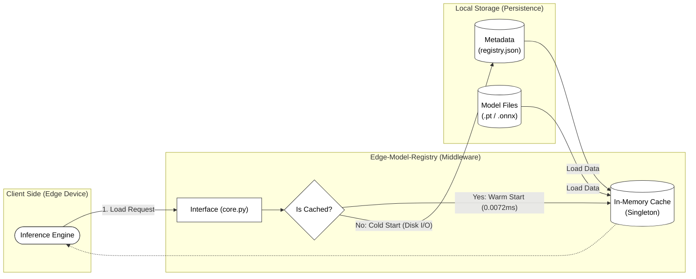

# Edge-Model-Registry


**A lightweight, zero-dependency model registry designed for isolated Edge AI environments.**

## 1. Project Background & Problem Definition

In typical MLOps pipelines, model registries rely on heavy infrastructure like SQL databases or Cloud Storage (S3). However, **Edge Devices** (e.g., Medical Devices, Factory Controllers) operate under strict constraints:
* **No Internet Connection:** Cloud-based registries are inaccessible.
* **Limited Resources:** Heavy DB processes consume vital RAM/CPU needed for inference.
* **Data Persistence:** Metadata must survive system reboots without external dependencies.

**Edge-Model-Registry** solves these problems by providing a file-system-based registry with **Atomic Persistence** and **Singleton-based Memory Optimization**.

---

## 2. Key Features

### 🔹 1. Zero-Dependency Persistence
* Uses a **JSON-based storage engine** instead of SQL/NoSQL databases.
* Ensures metadata retention across system reboots.
* **Why JSON?** For edge setups handling <1,000 models, file I/O overhead is negligible compared to the maintenance cost of a DB server.

### 🔹 2. Data Integrity (Atomic Writes)
* Implements **Atomic Write Pattern** (write-temp-and-move) to prevent data corruption.
* Guarantees `registry.json` integrity even if the system crashes during a save operation.

### 🔹 3. Strict Singleton & Caching
* Implements **Strict Singleton Pattern** using `__new__` to ensure a single source of truth for cache state.
* **Lazy Loading Strategy:** Reduces redundant disk I/O by caching model binaries in memory after the first access.
* **Benchmark:** Achieved **~75x speedup** in warm-start loading.

---

## 3. Installation

```bash
# Clone the repository
git clone [https://github.com/YourUsername/Edge-Model-Registry.git](https://github.com/YourUsername/Edge-Model-Registry.git)

# Install dependencies (Minimal)
pip install -r requirements.txt
```

## 4. Quick Start
You can verify the system capabilities by running the demo script
```bash
python examples/quick_start.py
```
### Usage Example (Python API)
```bash
from edge_registry import ModelRegistry

# 1. Initialize Registry (Auto-creates storage at './data')
registry = ModelRegistry(base_dir="./data")

# 2. Register a Model
model = registry.register_model(
    name="YOLOv8-Nano",
    version="v1.0.0",
    model_path="./my_model.pt",
    metrics={"mAP": 0.85, "latency": 15.2}
)

# 3. Load Model (With Caching)
# First call: Loads from disk
model_obj = registry.load_model("YOLOv8-Nano", "v1.0.0")

# Second call: Returns cached object instantly
model_obj_cached = registry.load_model("YOLOv8-Nano", "v1.0.0")
```

## 5. System Architecture

The system is designed with a 3-Tier Architecture to ensure separation of concerns.



| Layer | Component | Responsibility |
| :--- | :--- | :--- |
| **Interface** | `core.py` | API Surface, Validation, Exception Handling |
| **Caching** | `_in_memory_cache` | Singleton Management, Lazy Loading |
| **Storage** | `registry.json` | Metadata Persistence, File System Mapping |

## 6. Performance Benchmark

Tested on standard environment (Intel i7 / Windows 11)

| Operation | Access Type | Latency (ms) | Note |
| :--- | :--- | :--- | :--- |
| **Cold Start** | Disk I/O | 0.5414 ms | OS File Read overhead |
| **Warm Start** | Memory Cache | **0.0072 ms** | **75.7x Faster** |

## 7. Future Work (Roadmap)

* [ ] Add **File Locking** mechanism for multi-process safety.
* [ ] Support **S3 Integration** for hybrid (Cloud-Edge) sync.

* [ ] Add CLI support (e.g., `registry list`, `registry push`).


